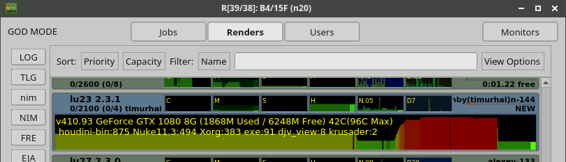
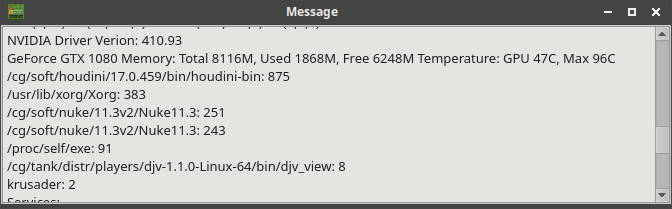

======
Render
======

Render is a client application.
It runs on a remote host and communicates with server.
Server sends tasks to render to run. 

Launch Methods
==============

 -  MS Windows script

    ``start\AFANASY\99.render.cmd``

 -  UNIX script
    
    ``start/AFANASY/_afrender.sh``

 -  Linux daemon when packages are installed

    ``sudo systemctl start afrender``

 -  Setup CGRU environment and launch a command:

    .. code-block:: bash

    	cd cgru
    	source ./setup.sh
    	afrender

To register a render already in [nimby|NIMBY] state use command:

.. code-block:: bash
    
    afrender [nimby|NIMBY]

Attributes
==========

name
----
Each render has an unique name. If new render comes to server with the name which already exists, server will not register it. Users and jobs hosts masks are based on render names and Regular Expressions (they are Perl-like).
To launch another render on the same host use AF_HOSTNAME environment variable to override render name.

address.family
--------------
address.ip
----------
IP address with family (IPv4 or IPv6).

netifs[]
--------
Network interfaces information (name, mac and ips).

time_launch
-----------
Time the application was launched.

time_register
-------------
Time the render was registered on server.

time_update
-----------
Last time the render has update its resources usage.

wol_operation_time
------------------
Time the last any Wake-On-LAN operation was performed.

tasks[]
-------
Running tasks number and some its attributes (user, job, etc.).

capacity_used
-------------
Capacity used by running tasks.

Editable Parameters
===================

user_name
---------
Who launched a render. Can be changed only by administrators. Note that process do not change uid. This value for afanasy only.

priority
--------
Render with greater priority get task first.

capacity
--------
You can override host farm setup capacity.

max_tasks
---------
You can override host farm setup maximum running tasks.

services
--------
Services that render can run.
If empty it it configured by pool.

services_disabled
-----------------
You can disable some services.

annotation
----------
Annotate render GUI item.

State
=====

=========== ======= ===
Online      ``ONL`` Is online. 
Offline     ``OFF`` Is offline.
nimby       ``Nby`` Is taken by his user. Only render user can render on it.
NIMBY       ``NBY`` Is taken by his user and he don't want to render on it.
Busy        ``RUN`` Executing one or more tasks.
Dirty       ``DRT`` Capacity changed or some service disabled.
WOLFalling  ``WFL`` Is falling a sleep. It was asked to sleep, but still online.
WOLSleeping ``WSL`` Is sleeping.
WOLWaking   ``WWK`` Is waking up. It was asked to wake up but still is not online.
Paused      ``PAU`` Is paused, like super-Nimby, never will be free automatically.
Sick        ``SIC`` Is seek, produced errors only from different users.
=========== ======= ===

Resources
=========

cpu_num
-------
CPUs x Cores number.

cpu_mhz
-------
Fist Processor frequency.

cpu_loadavg[3]
--------------
Load average.

cpu_user
--------
User usage percentage.

cpu_nice
--------
User 'nice' usage percentage (low priority processes).

cpu_system
----------
System usage percentage.

cpu_idle
--------
Idle percentage (CPU free).

cpu_iowait
----------
Waiting for I/O complete percentage.

cpu_irq
-------
Interrupts servicing percentage.

cpu_softirq
-----------
Soft interrupts servicing percentage.

mem_total_mb
------------
Total amount of memory in megabytes.

mem_free_mb
-----------
Free memory in megabytes.

mem_cached_mb
-------------
Cached memory in megabytes.

mem_buffers_mb
--------------
Buffered memory in megabytes.

swap_total_mb
-------------
Total swap space in megabytes.

swap_used_mb
------------
Used swap in megabytes.

hdd_total_gb
------------
Total disk space in gigabytes.

hdd_free_gb
-----------
Available free disk space in gigabytes (in root - '/').

hdd_rd_kbsec
------------
Disk reading in kilobytes per second.

hdd_wr_kbsec
------------
Disk writing in kilobytes per second.

hdd_busy
--------
Percentage of system ticks spend for the disk IO.

net_recv_kbsec
--------------
Network receiving traffic in kilobytes per second.

net_send_kbsec
--------------
Network sending traffic in kilobytes per second.

Paths Map
=========

CGRU has an ability to map paths.
Every client can have own paths map file to translate paths to server and from server.

Paths map is described in config files by pathsmap object.
It is an arrays of ``["CLIENT","SERVER"]`` paths pairs:

.. code-block:: json
    
    {
        "pathsmap":[
            ["//server/projects/","/mnt/prj/"],
            ["//server/tools/","/mnt/tools/"]
        ],
    }

When job constructs (on the client side) all commands and working directories are translated from client to server.
When task starts (on the client side) all commands and working directories are translated from server to client.
Server does know nothing about paths map.

MS Windows platform issues
--------------------------
 - You can write only ``/`` slashes in a config.
   It will try both slashes directions.
   Some applications allows client to use and ``\`` and ``/`` slashes, so pattern will be matched in any case.
 - When client searches a pattern it converts paths in lower case.
   So no matter how client wrote a path ``//server/projects/``, ``//SERVER/PROJECTS/``, ``//SERVER/projects/`` or ``//server/PROJECTS/``.
   It will work any way.
 - Module (Python Class) can works in *UnixSeparators* mode.
   During translation from server to client it uses ``/`` slashes for client paths.
   For example NUKE uses only ``/`` slashes on any platform.

A part of a real working ``config.json`` with map example:

.. code-block:: json

    {
        "OS_windows":{
            "pathsmap":[
                ["P:/",             "/ps/prj/"],
                ["//box/project/",  "/ps/prj/"],
                ["Q:/",             "/ps/prj2/"],
                ["//box2/project/", "/ps/prj2/"],
                ["//sun/libs/",     "/ps/lib/"],
                ["//sun/vault/",    "/ps/vault/"],
                ["T:/",             "/ps/etc/"],
                ["c:/ps/",          "/ps/"],
                ["c:/temp/",        "/tmp/"]
            ]
        }
    }

Services
========

Service is a Python class that will be instanced by render on each incoming task.

Python classes stored in

``cgru/afanasy/python/services``

and based from

``cgru/afanasy/python/services/service.py``

The class stands for:

- Define default service parser, that you can override.
- Instance needed parser and pass task output data it.
- Method to fill in numeric block pattern with frames.
- Method to transfer commands and paths from server to client (different OS-es can have different paths).
- Check rendered files.
- Generate thumbnails.
- Check exit status for tasks that can return non zero exit status on success.
- Method to insert in task command variable capacity coefficient.
- Method to fill in multi-host task command with captured hosts.

You can write custom service class based on ``service.py`` to override any functions for customization.

Parsers
=======

Parser read task output and calculate running percentage and frame (for multiply frames per render).

Python classes stored in

``cgru/afanasy/python/parsers``

and based from

``cgru/afanasy/python/parsers/parser.py``

Parser class stands for:

- Parse task progress frame and percent of a current frame and a total(all frames) percentage.
- Parse output for rendered file to make thumbnails, that render will send to server.
- Stop task on bad output.
- Produce a warning just for user notification.
- Mark success finish as error on bad output.
- Append some string to task log for some useful info.
- Make some job report what will be shown in GUI job item as something important.

To write a custom parser you should inherit base parser class and override main function:

do
--

.. code-block:: python

    def do(self, data, mode):

Input arguments:

data(str)
---------
Current portion of a task process output.

mode(str)
---------
- ``RUN``: Task is running.
- ``EXIT_CODE:STOP_TIME``: Task is not running, process exit status and stop time if task was asked to stop (zero if was not).

This method can return nothing or a string.
In string case this string will be stored instead of incoming data.
You can use it to produce some message, by appending incoming data with your information.
Or you can cut some useless information.

All parser notifications and actions are transferred by setting class members:

self.percent(int)
-----------------
Task execution percentage.

self.frame(int)
---------------
Task execution frame. May set for multiply frame tasks to show current frame in GUI.

self.percentframe(int)
----------------------
Task execution current frame percentage.

self.warning(False/True)
------------------------
Some warning. To notify user only.

self.error(False/True)
----------------------
Error. Render will try to terminate a task and later kill if task ignored termination.

self.badresult(False/True)
--------------------------
Error. Task will finish with an error.
In this case render will not try to kill it, sometimes you don't need kill and want to wait finish.
You can use at the end of task execution, at final result check.

self.finishedsuccess(False/True)
--------------------------------
Success. Task will finish with a success.
Parser can consider that task is already done and should not to continue.
Render will terminate(kill) task process and send "done" status to server(not an "error").

self.activity(str)
------------------
Some string to inform user about task running stage.
For example: Nuke current rendering view when stereo, Movie Maker convert or encode stage.

self.log(str)
-------------
Some string to append to the task server log.
For example when server or parser noticed some error, you can specify it here.

self.report(str)
----------------
Some info string for an entire job.
GUIs will show it a job item(not task).
Some most important info should be here.
Most suitable for a job with one or several big tasks. For example you can put big file on FTP and show speed here.

Thumbnails
==========

Thumbnails are small previews of a task rendered files.
They can be generated by render and shown by GUI.

If task (block) has files parameter or parser finds images thumbnail will be generated.
Thumbnails are generated by afrender after task process finish.
Python service doPost function returns commands for it.
Thumbnail files binary data is send by afrender to afserver along with task output.
Server stores all files that afrender sends on task finis.
You can get tasks thumbnails from afserver by HTTP GET method.

If parser found some image during output parsing it can call a special function:

appendFile(i_file, i_onthefly)
------------------------------

- **i_file**

  Path to the image file to append.

- **i_onthefly**

    - **False**
      Thumbnail will be generated after task process finish. This is a most common method.

    - **True**
      Thumbnail will be generated just after this function call.
      Task probably will be still running in this case.
      This can be useful for a long time task that process many images.
      Good example is a movie encoding or dailies creation.

Configuration
-------------
.. code-block:: json

    {
        "af_thumbnail_extensions":["exr","dpx","jpg","jpeg","png","tif","tiff","tga"],
        "af_thumbnail_cmd":"convert -identify \"%(image)s\" -thumbnail \"100x100^\" -gravity center -extent 100x100 \"%(thumbnail)s\"",
    }

Custom Resources
================

You can write custom resources meter(s) on Python.
Render instances a class and runs update method periodically (each time the Render updates).
You can inherit base resbase class and set its properties.

There are some custom resources meters in Afanasy:

example
-------
Just an example.
It increments a value from 0 to 100, changes label text, plotter and label size, graph and back color.

iostat
------
Shows parsed output of Linux iostat command.
Graph value is utilization percentage (or %busy).

nvidia-smi
----------
Shows parsed output of Linux nvidia-smi command.
It shows NVIDIA driver version, product name, total and used memory, temperature, running processes.

Python classes stored in

``cgru/afanasy/python/resources``

and based from

``cgru/afanasy/python/resources/resbase.py``

Information is passed within class properties:

Properties
----------

self.value(int)
...............
The resource value to watch.

self.valuemax(int)
..................
Maximum resource value for graph scale.

self.height(int)
................
Preferred plotter widget height for GUI.

self.width(int)
...............
Preferred plotter widget width for GUI.

self.graphr(int)
................
self.graphrg(int)
.................
self.graphb(int)
................
Graph color.

self.label(str)
...............
Label text.

self.labelsize(int)
...................
Label text font size.

self.labelr(int)
................
self.labelg(int)
................
self.labelb(int)
................
Label text font color.

self.bgcolorr(int)
..................
self.bgcolorg(int)
..................
self.bgcolorb(int)
..................
Plotter background color.

self.tooltip(str)
.................
Widget tooltip.

self.valid(False|True)
......................
Resource meter validness.
Should be set to True in constructor, or update function will not be called.
Set False if resource meter initialization failed.

Windows Must Die
================

Farm based on MS Windows OS can produce some 'bad' windows.
If process crashed, Windows OS can launch a window with apologizes, and 'hung' the process until someone closes this window.

Afanasy Render client periodically finds and closes windows listed in ``af_render_windowsmustdie`` configuration parameter.

It closes them by sending ``WM_CLOSE`` signal.

``af_render_windowsmustdie`` parameter example:

.. code-block:: json

    {
        "af_render_windowsmustdie":[
            "ImageMagick Studio library and utility programs",
            "Microsoft Visual C++ Runtime Library",
            "QuickTimeHelper-32.exe - Application Error",
            "Visual Studio Just-In-Time Debugger"
        ]
    }

