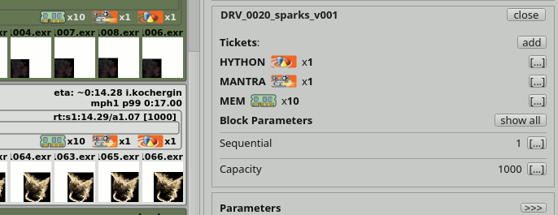

.. _afanasy-tickets:

=======
Tickets
=======

Ticket is some named counter.

Pool can have *host* and *pool* tickets.
*Host* means that each pool host has such tickets.
*Pool* means that an entire pool has this tickets.

If job block has tickets it can run only on pools and renders that has such tickets enough.
Each block task will be produced with block tickets.
When render starting task with tickets, it counts tickets usage.
Pool counts total tickets usage.

	AfWatch job block tickets

For example if you want to limit licenses on the entire farm,
you can set ``NUKE:20`` *pool* tickets on the root pool.
If you want to limit RAM usage on each pool host,
You can set ``MEM:64`` *host* tickets on a pool which renders has 64GB RAM.
And each pool render will be able to run one task with ``MEM:64`` tickets,
or 2 tasks with ``MEM:32``, or 1 ``MEM:32`` and 3 ``MEM:10`` tasks at the same time.
Just one side effect will appear in this case,
pools will count total ``MEM`` tickets and renders will count ``NUKE`` tickets too.

Ticket can be displayed as some custom image,
if a png file with the same name exists in the directory:

``cgru/icons/tickets``

If a ticket icon file exists, GUI will replace ticket name with its icon.
Unlike serivce, where icon is painted along with name.
Also ticket icon will not be resized to a square image, so ticket can be painted as a rectangle.
This is done to make tickets and services more differ in a GUI, to not to mess them.
And they will be differ more, if tickets names will be uppercase, unlike services, that are all lowercase.

Also pool tickets has a maximum hosts limit.
This is mostly needed for licence hosts limits.
There is a common type of licensing where you can run multiple instances of software on same host, occupying only single license.

