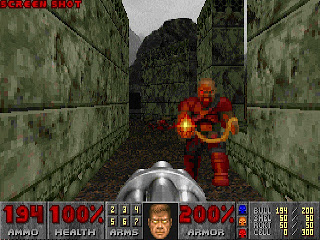
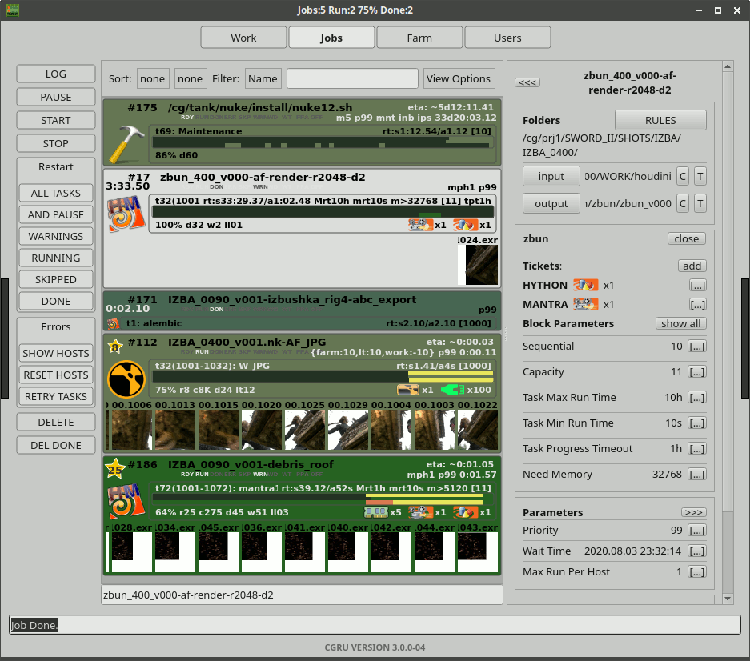
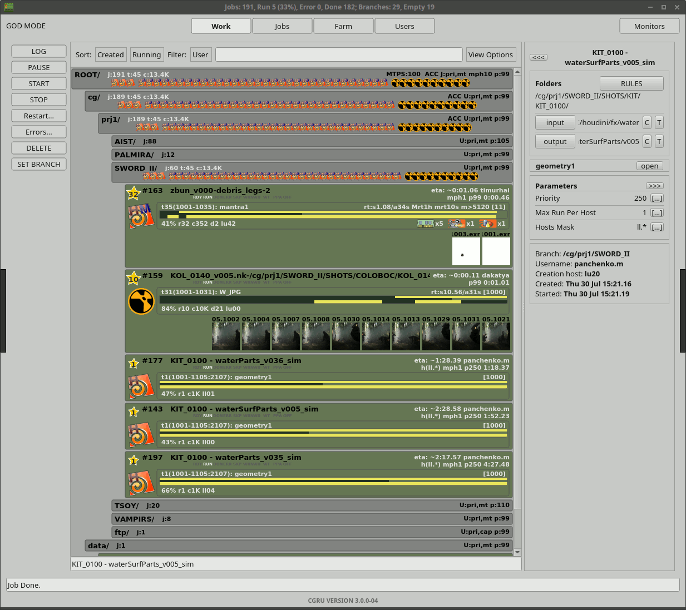
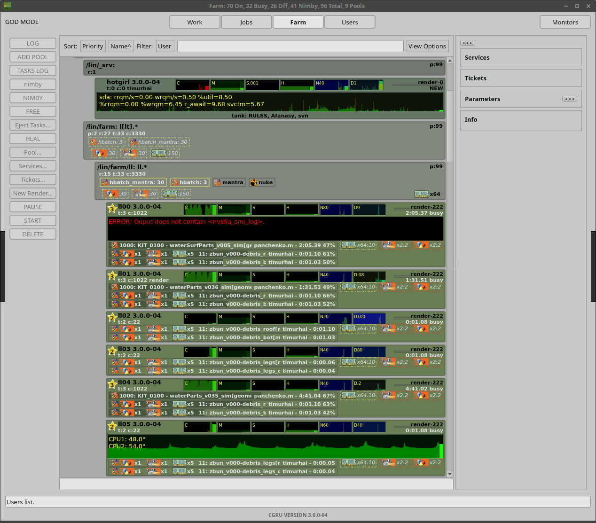
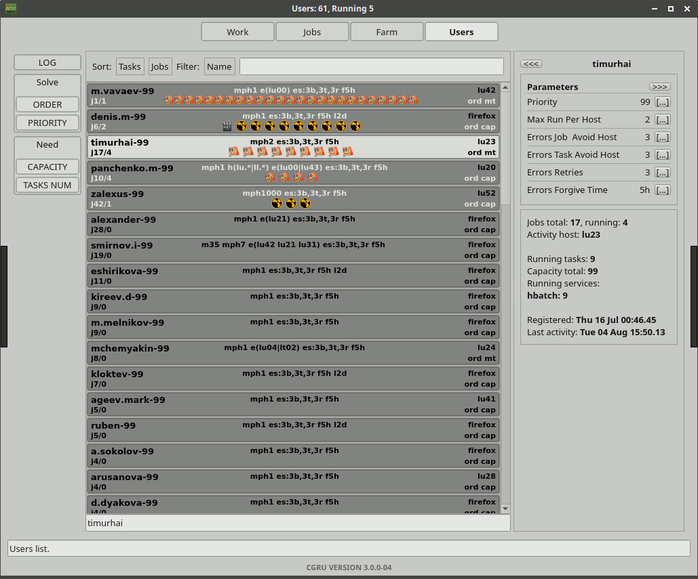
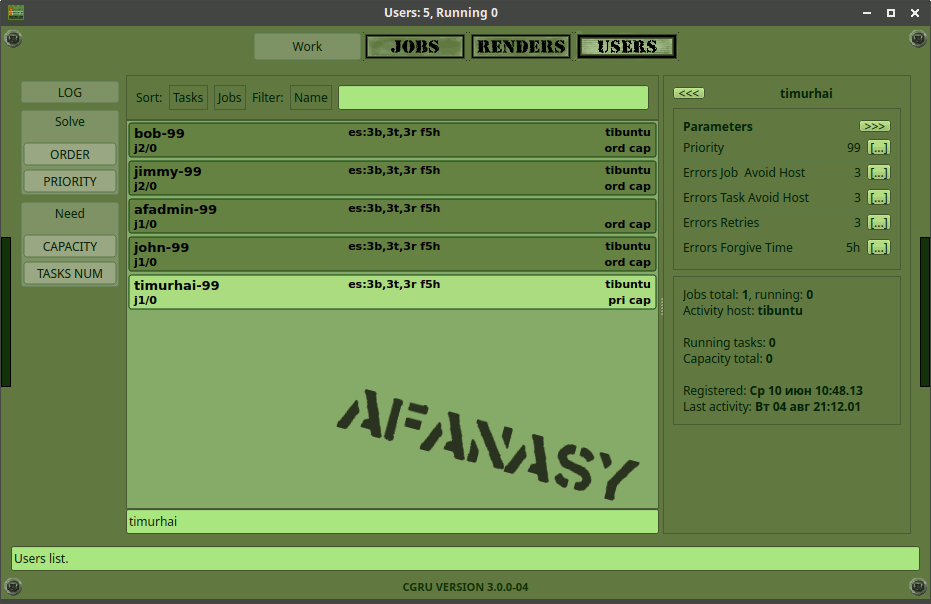

=====
Watch
=====

Watch is a Qt GUI for Afanasy.

Modes
=====

It has several user modes for farm administration purposes:

 - **USER** user mode:

 	User can change his parameters and operate his jobs only.

 - **VISOR** super user mode:

 	Can change parameter of any user and operate jobs of any user.

 - **GOD** admin mode:

 	Can do anything, operate any user, any job and farm (renders and pools).

To switch user mode you need to type password in active Watch window
(you do not need to re-login to switch between modes).
To reset super user mode you can type password again.

You can configure passwords in a CGRU config JSON file by variables:

pswd_visor
----------

	Visor passwords *md5* sum.
	Password must be 5 characters length.

	Default value is *1832116180fdc61b64fd978401e462e9*

	It is ``IDKFA``

pswd_god
--------

	God password *md5* sum
	Password must be 5 characters length.

	Default value is *73bcaaa458bff0d27989ed331b68b64d*

	It is ``IDDQD``

UI Levels
=========

At first Watch was designed as a minimalistic GUI, like hand watches.
With a lots of abbreviated words, to fit lots of information on a small screen.
But later it begin to grow and got several UI levels to display brief or full info.

 - **Padawan**
 	You will see parameters with a full names.
	Useful when you just started to use Afanasy.
 - **Jedi**
	You will see parameters with a brief names.
	Useful when you know most parameters.
 - **Sith**
	You will see parameters with a abbreviated names.
	It is like on hand watches, where you see "TU 4", instead of "Today it is Tuesday, 4th August 2020 Year",
	as you are definitely know that it is August 2020,
	"TU" is Tuesday, and next "4" number means the day of month.

	Main window menu will disappear for space economy.
	It will be available on RMB menu at window top.

Jobs
====

This is a list of user jobs.

Work
====

This is a hierarchy of branches and jobs from all users.
Only VISOR can make changes here.
For a common user this list is read only.

Farm
====

This is a hierarchy of pools and renders.
Only admin can make changes here.
For a common user this list is read only.

Users
=====

This is a list of all Afanasy users.
User can manipulate only own node.
Admin can manipulate any user node.

Styles
======

Watch GUI has a several Color Themes:

Light
-----

.. image:: images/afwatch_style_light.png

Dark
----

.. image:: images/afwatch_style_dark.png

Military
--------

First versions has no Color Themes and UI Levels.
AfWatch GUI always had Military theme and Jedi level.

Hello Kitty
-----------

.. image:: images/afwatch_style_hello_kitty.png

Hello Kitty Hell
----------------

.. image:: images/afwatch_style_hello_kitty_hell.png

