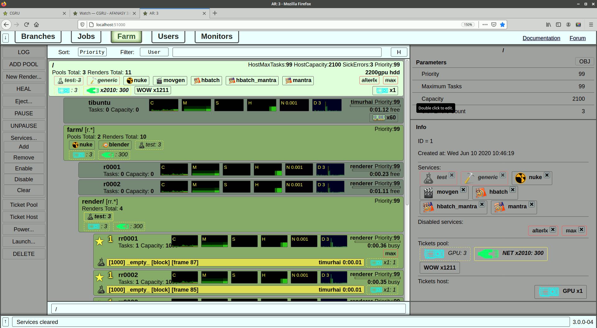

=======
Web GUI
=======

There is a Web GUI for Afanasy.

Afanasy server supports some web server functions to be able to run this GUI.
No other software or plugins needed.

Too see Afanasy page, type ``server_name:51000`` in a browser address bar,
where 5100 is the default Afanasy server port.

Web GUI is useful for administrators to manage farm
from some special machines (devices) where CGRU can't be installed.

If you setup some VPN, you can monitor jobs from smartphone.

.. important::

	Try not to use Web GUI as a common Afanasy GUI instead of Watch.
	Web GUI consumes much more resources and on client and on server side.
	Also it needs much more traffic.
	On a large number of GUI items browser can take lots of RAM.
	If browser tries to show more that 10000 items it can hung.

Online Version
--------------

Online version is designed to let users to try Afanasy via WEB GUI.
You can change parameters, restart jobs.
You even can to delete everything and it will be empty till the next demo start.

http://afanasy.cgru.info:51000

- This is not a real working server at CG company.
- All render clients and server are running on the same host.
- Server does not accept new jobs.
- Server does not allow to change existing tasks commands.
- All services (tasks) starts a simple python script that just sleeps for some time.

