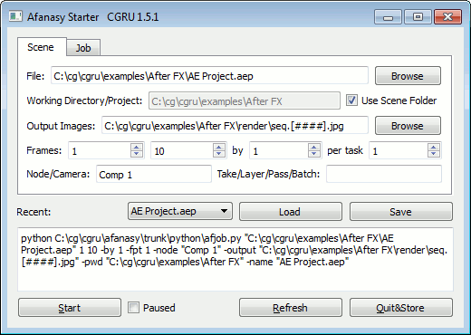

AfStarter
=========

AfStarter is a standalone dialog to submit a job to Afanasy.

Supported software
------------------

 - Adobe After Effects
 - Autodesk 3D Studio Max

    - Software
    - VRay

 - Autodesk Maya

    - Software
    - 3DeLight
    - VRay
    - Arnold
    - Mental Ray
    - Redshift

 - Autodesk SoftImage XSI

 - Blender

    - Internal
    - Cycles

 - Clarisse iFX
 - Cinema 4D
 - Fusion
 - Isotropix Clarisse
 - Natron
 - SideFX Houdini

    - HBatch *(hython)*
    - Mantra *(standalone)*

 - The Foundry Nuke

Scene Settings
--------------

Scene Parameters:

 - **File**: Scene file path. IFD files sequence for Mantra.
 - **Working Directory/Project**: Tasks process working folder, default is scene folder. Project path for Maya.
 - **Output Images**: Some software allows to override output images in command line arguments.
 - **Frames**: Frame range to render, 'by' - frames step or increment, 'per task' - number of frames in one task.
 - **Node/Camera**: Houdini ROP, Nuke write node, Max, Maya camera to render, After FX composition.
 - **Take/Layer/Pass/Batch**: Houdini take, SoftImage pass, Maya layer, Max batch to render, After FX render settings template.
 - **Recent**: Store recent sent jobs settings.
 - **Start**: Submit job to Afanasy server. It can be started in off-line state ("paused").

Afanasy Job Settings
--------------------

.. image:: dialog_job.png

Afanasy Parameters:

 - **Name**: Job name, scene file name is used by default.
 - **Capacity**: Tasks capacity attribute value. '-1' means use the default.
 - **Priority**: Job order in user jobs list.
 - **Maximum Running Tasks**: Maximum number of tasks can be running at the same time.
 - **Depend Mask**: Job(s) name pattern to wait to. Global: wait job(s) of any user.
 - **Hosts Mask**: Host(s) name pattern to run on. Exclude: not to run on such hosts.

