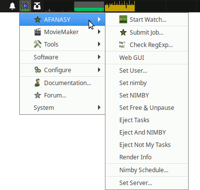
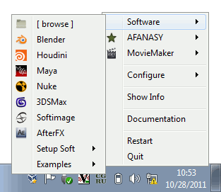
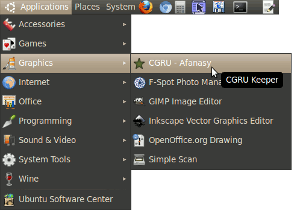

Keeper
======

Description
-----------

Keeper is a system tray icon menu to launch and manage CGRU applications,
launch and configure other software.
It shows local afrender state with R character color,
and a local host memory usage, it asks afserver for render info.

**Afanasy Menu:**

**Software Menu:**

Keeper also can listen port launch commands.
Afanasy WebGUI and RULES uses keeper to run something.

Start Keeper
------------

 - **MS Windows**: ``cgru\start.cmd``
 - **Mac OS X**: ``cgru/start.command``
 - **Linux**: ``cgru/start.sh``

Linux CGRU package creates an item in Applications menu to launch Keeper:

Launch System commands
----------------------

Rules and Afanasy Web GUIs launch system commands via keeper.
Web browsers can't launch system commands due security reasons.
But they can ask Keeper to launch a command.

Rules assumes to use secured HTTPS protocol, as designed to work over internet (external port).
Browsers can't mix HTTPS and HTTP protocol for security reasons too.
So keeper should use HTTPS protocol for commands.
This means that we should setup Keeper HTTPS server.

HTTPS Server
------------

Keeper uses HTTPServer module and a ssl module to wrap its socket.
On start it checks *cgru/utilities/keeper/serverhttps.pem* certificate file for existence.
To generate it you can execute:

``openssl req -new -x509 -keyout serverhttps.pem -out serverhttps.pem -days 3656 -nodes``

If this file exists, Keeper starts to listen 44443 port.

The next you should create a security exception in a browser for this certificate.
For this you should open Keeper test page and confirm a security exception.
To open Keeper test page you can use this Keeper tray menu item:
*Configure -> HTTPS Server...*

