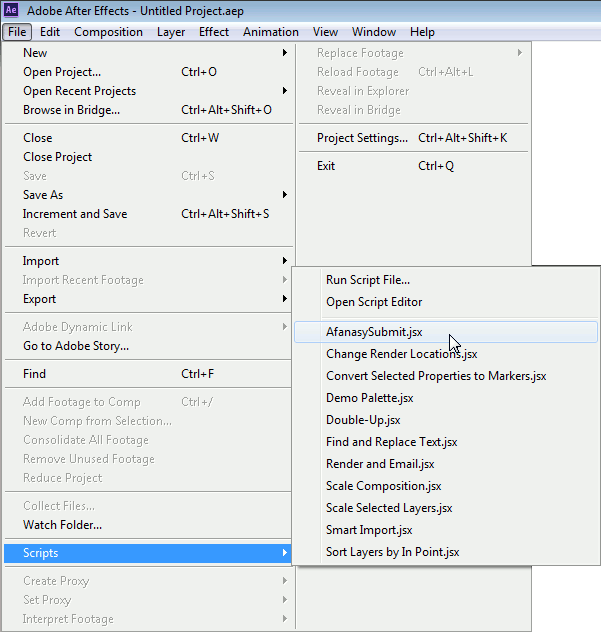
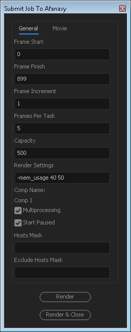
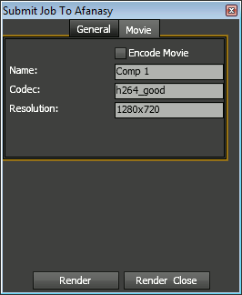
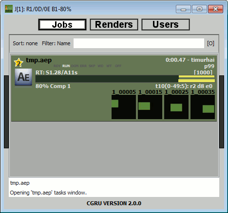

Adobe After Effects
===================

Installation
------------

- Put a script from CGRU plugins folder
  
  ``C:\cgru\plugins\afterfx\Afanasy.py``

  to AfterFX scripts folder

  ``C:\Program Files\Adobe\Adobe After Effects CS6\Support Files\Scripts``

- Allow script to connect network

  *Preferences - General - Allow scripts to Write Files and Access Network*

Tool Dialog
-----------

General Tab
...........
Here are general job parameters.

Movie Tab
.........
Here you can ask Afanasy to create a small preview movie.

Watch Job
---------
This is how a job will be displayed in the Watch GUI.

Shared Script Location
----------------------

You can put a CGRU plugin script to some shared (network) location.
In this case you should create a script:

``C:\Program Files\Adobe\Adobe After Effects CS6\Support Files\Scripts\Afanasy.jsx``

.. code-block:: javascript

	var scriptFile = new File("\\\\server\\share\\cgru\\plugins\\afterfx\\Afanasy.jsx");
	scriptFile.open();
	eval(scriptFile.read());
	scriptFile.close();

