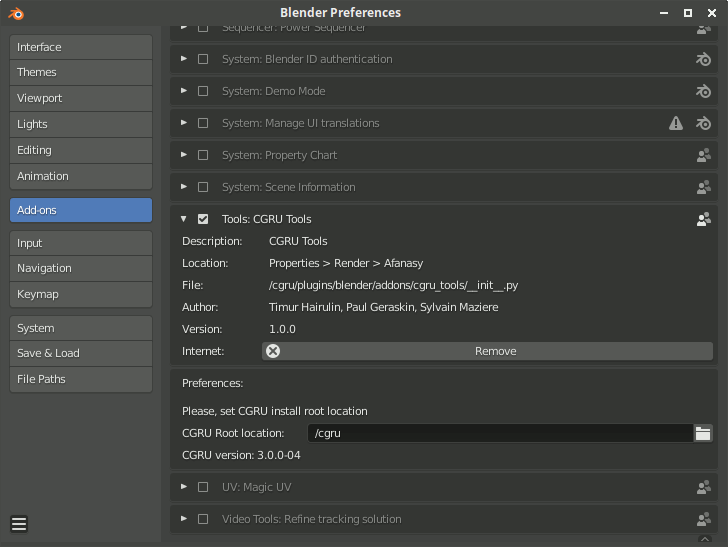
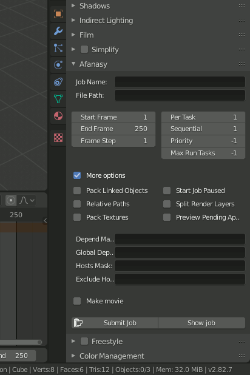
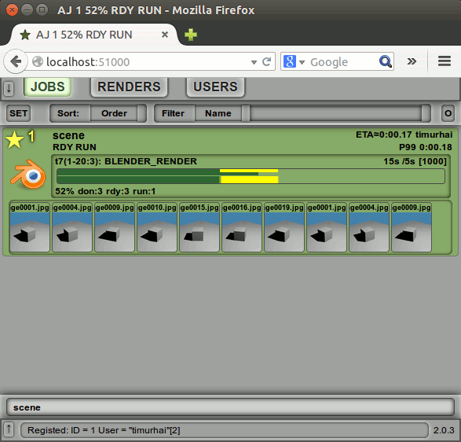
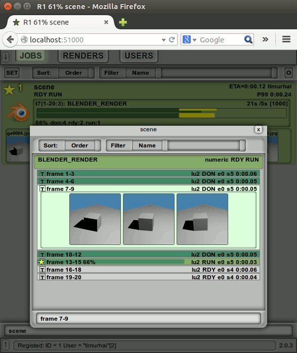

=======
Blender
=======

Setup
=====

If you run Blender from CGRU Keeper, it addon will be added automatically.

You can setup CGRU addon manually. It is located in:

``/opt/cgru/plugins/blender``

Or in some custom location you have unpacked CGRU in.

	Blender Preferences Window

If you run blender not from CGRU and installed addon manually,
you should setup CGRU location for the addon.
It needed as the addon uses other python scripts from CGRU.

Properties
==========

	Blender Afanasy Properties

- Job Name
    Afanasy job name. If empty scene name will be used.
- File Path
    If not empty, override output images to render.
- Start Job Paused
    Start job paused (send in off-line state).
- Split Render Layers
    Render different layers in a separate job blocks. Warning: this option disable post-processing passes (compositing nor seqeuncer are execute)
- Pack Linked Objects
    Make local all linked groups and objects.
- Pack Textures
    Pack all textures into the blend file.
- Start
    First frame to render.
- End
    Last frame to render.
- By
    Frames "jump" or increment.
- Per Task
    Number of frames in each task.
- Priority
    Job priority (execution order), ``-1`` means default.
- Max Run Tasks
    Maximum number of running at the same time tasks, ``-1`` means no limit.
- Depend Mask
    Other job(s) name pattern to wait. Empty value means not wait any job.
- Global Depend
    Other job(s) pattern of any user to wait.
- Hosts Mask
    Hosts names pattern job tasks can run on. If empty job can run on any host.
- Exclude Hosts
    Hosts names pattern job tasks can not run on.
- Submit Job
    Construct a job and send it to server.

Job GUI
=======

Job
---

	Web GUI Jobs List.

Tasks
-----

	Web GUI Jobs Tasks List.

