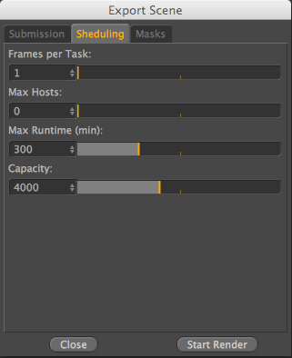
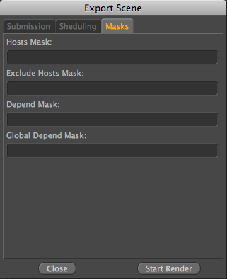

=========
Cinema 4D
=========

Afanasy Dialog
==============

.. image:: images/cinema4d_dialog_submission.png

Submission
==========

- Job Name
    Afanasy job name. Default is the scene-name
- Overwrite Output
    Overwrites the Render-Output-Path
- Priority
    Job order in user jobs list ('-1' means to keep this value default)
- Framerange
    Framerange to render on the farm
- By Frame
    Just renders every x frame. By default this is 1 so it renders every frame
- Bake Constraints
    Bakes the constraints and then saves a copy of the scene which gets rendered (currently it only bakes xxx)
- Do not copy Scene to Hosts
    By default it copies the scene and the textures locally to the farm and also renders the images locally.
    After it finished it copies then the finished renderings back to the server.
    If this is not wanted for some reason it can get deactivated here and it loads everything from the farm and saves directly to the farm
- Create Job Paused
    The submitted job is then paused and has to be started manually

Scheduling
==========

- Frames per Task
    Number of frames in each task
- Max Hosts
    Maximum number of Hosts to use (0 means to keep the default value)
- Max Runtime (min)
    How long a frame is allowed to render maximum before it gets re-queued
- Capacity
    Tasks capacity value

Masks
=====
- Hosts Mask
    Hosts names pattern where job can run on (empty value means that job can run on host with any name)
- Exclude Hosts Mask
    Hosts names pattern where job can not run on
- Depend Mask
    Same user jobs names pattern to wait to be done to start (empty value means not to wait any job)
- Global Depend Mask
    Same as Depend Mask, but waits for a jobs from any user

