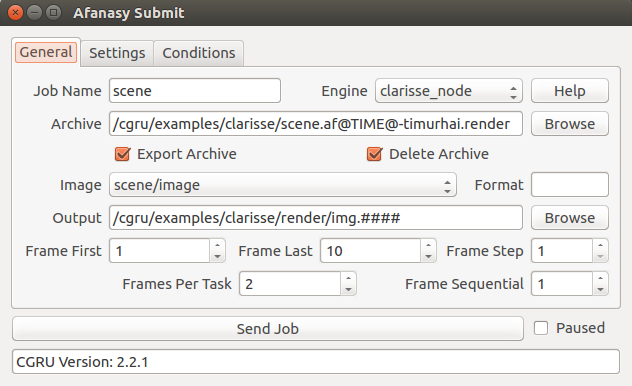
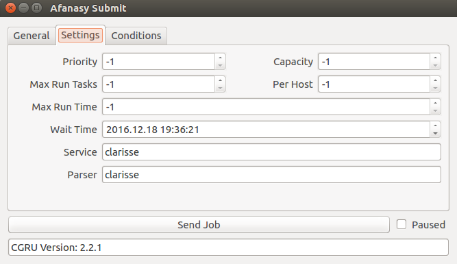
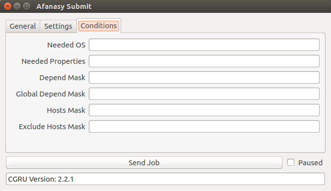
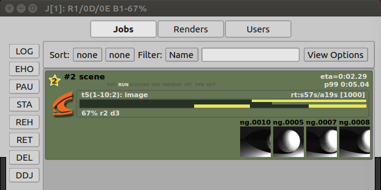
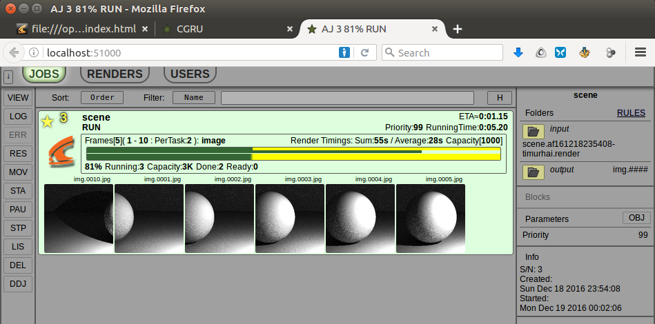
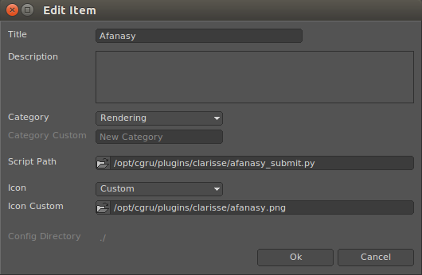

.. _software-clarisse:

============
Clarisse iFX
============

In-App Submission
=================

This a Python script.
It get some project attributes and creates a dialog.
In this dialog you can change parameters and send job to server.
By default script exports project to render archive with some temporary name.
And after render, when user deletes job, temporary archive will be deleted too.

General Tab
-----------

- Engine
    - clarisse_node
	    CGRU command used to launch Clarisse cnode. By default it will launch the latest (alphabetically) version.
    - clarisse_render
	    CGRU command used to launch Clarisse crender.
    - cnode
	    System command will be searched in PATH environment.
    - crender
	    System command will be searched in PATH environment.

Settings Tab
------------

Negative value means use defaults.

Conditions Tab
--------------

Empty field disables condition.

AfWatch
=======

WebGUI
======

Setup
=====

Shelf Item
----------

AfStarter
=========

You can also send Clarisse render archive to Afanasy with a stand-alone dialog AfStarter_.
You do not need to open main Clarisse application (GUI) for it.

.. _AfStarter: ../afstarter/afstarter.html

Developers
==========

In-app submission dialog GUI is created with PyQt (PySide).
Qt binding in Python is represented by a Qt.
It chooses existing Qt binding automatically.

Submission script:

https://github.com/CGRU/cgru/blob/master/plugins/clarisse/afanasy_submit.py

