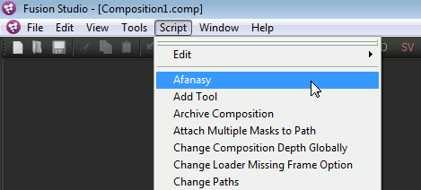
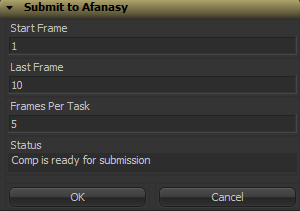
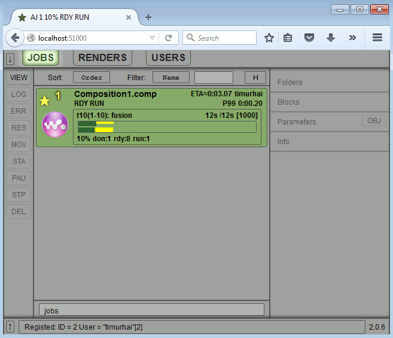

.. _software-fusion:

======
Fusion
======

Menu
====

There is a script that raises a dialog that constructs and send jobs to server.

Dialog
======

- Start Frame
- First frame to render.
- Last Frame
- Last frame to render.
- Frames Per Task
- Number of frames in task.

Job GUI
=======

Setup
=====

You can just run Fusion from Keeper.
This way menu item (script) will be added automatically by preferences manipulation.

To setup manually, you can copy script

``cgru\plugins\fusion\Comp\Afanasy.eyeonscript``

to Fusion scripts folder

``C:\Program Files\Blackmagic Design\Fusion\Scripts\Comp``

