=======
Houdini
=======

Afanasy is represented by a special multi-functional ROP.
You can connect several other ROP-s to Afanasy ROP to render.
You can connect several Afanasy ROP-s to Afanasy ROP for a job with a complex dependencies.

Afanasy ROP
===========

- Submit
	Generate a job and send it to server.
- Start Paused
	Send a job in off-line state.
- Preview Approval
	Set job *preview approval* flag.
	For example, if sequential is 10, it will render every 10 frame and wait for approve.

General
-------

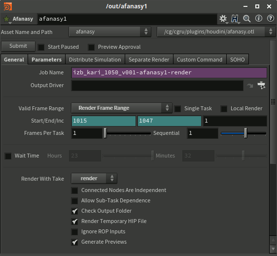

	Afanasy ROP General tab

- Job Name
	Afanasy job name.
- Output Driver
	You can not (don't want) to connect Afanasy ROP to render ROP, you can specify it.

- Valid Frame Range:
	- Render Any Frame
		Use frame range form downstream node. Or render current frame if no range in network defined.
	- Render Frame Range
		Render this specified frame range.
	- Render Frame Range Only (Strict)
		Render this specified frame range. Other ROP-s will wait this whole frame range rendered.
- Single Task
	- Generate single task for whole frame range, useful for simulations.
- Local Render
	Render on the local render client.
	Job host mask will be automatically set to the local host name.
- Frames Per Task
	Number of frames in each task.
- Sequential
	===== =====
	   1   Render frames one by one from the first to the last
	  10   Render every 10 frame at first, than render last other frames
	  -1   Render frames backwards from the last to the first
	 -10   Render every 10 frame at first backwards, than render last other frames backwards
	   0   Render the first, the last, the middle, the middle of the middle and so on
	===== =====

- Wait Time
	Set job *time_wait* parameter to the current day *Hours* and *Minutes*.
	If current time will be greater than specified, the next day will be used.

- Render With Take
	Specify take to render.
- Connected Nodes Are Independent
	Allow run the same frames of all connected nodes at the same time.
- Allow Sub-Task Dependence
	Tasks can wait other tasks to be done partially.
	Useful for simulations.
	Frames render can start w/o waiting the whole simulation is finished.
- Ignore ROP Inputs
	Do not execute input ROP-s.

Parameters
----------

.. figure:: images/houdini_afrop_parameters.png

	Afanasy ROP Parameters tab

- Platform
	OS type the job can launch tasks on:
		- **Any**: any OS.
		- **Native**: the same as this OTL was launched on.

- Tickets
	Use :ref:`afanasy-tickets`:
		- *Auto*: Submission script will try to set tickets automatically, depending on the ROP to render.
		- *Memory*: If not zero, this amount of *MEM* tickets will be set.
		- *Aux*: Any other tickets string as ``TICKET:COUNT`` comma separated list.

- Tickets
	Use :ref:`afanasy-pools` that are specified as ``pool:priority`` comma separated list.

- Enable Extended Parameters
	To switch ON/OFF it fast.
- Job :ref:`afanasy-branch`
	``$HIP`` should be used in most cases.
	No matter how deep you placed *hip* file in file-system.
	It just help to find server an existing parent branch (department, project, scene).
- Hosts Mask
	Hosts names pattern where job can run on (empty value means that job can run on host with any name).
- Exclude
	Hosts Mask Exclude: Hosts names pattern where job can not to run on.
- Depend Mask
	Same user jobs names pattern to wait to be done to start
- Global
	Depend Mask Global: Same as Depend Mask, but waits for a jobs from any user.
- Priority
	Job order in user jobs list
	(``-1`` means to use default value).
- Maximum Running Tasks
	Maximum tasks job can run at the same time
	(``-1`` means no limit).
- Per Host
	Maximum Running Tasks Per Host: Maximum running tasks on the same host.
	(``-1`` means no limit).
- Capacity
	Tasks capacity value (``-1`` means use default value).
	Render must have enough free capacity to run it.
- Render Time Min
	Minimum time task should run (seconds).
	Sometimes tasks finishes with a good exit status too early.
- Max
	Task maximum running time (in hours).
	If task will not finish after this time,
	it will considered as an error and will be restarted.
- Progress Timeout
	If a task will not produce any output for this time (in hours),
	it will be considered as an error.
- Min RAM
	Minimum free memory (Gigabytes) should have render client to be able to start a task.
- Override Service
	This will be any custom service name for a job block tasks.
- Parser
	Override Parser: This will be any custom parser name for a job block tasks.
- Life Time
	*DONE* job will be automatically deleted after this time (in hours).
	Useful for some auxiliary jobs.
- Files Check
	Service (task instanced Python class) can check rendered files for existence.
	Submitter (script) should know file names that task should produce.
	Can not work on expressions/*takes*/overrides.

	- Skip Existing
		Render can check files for existence before run task command.

Distribute Simulation
---------------------

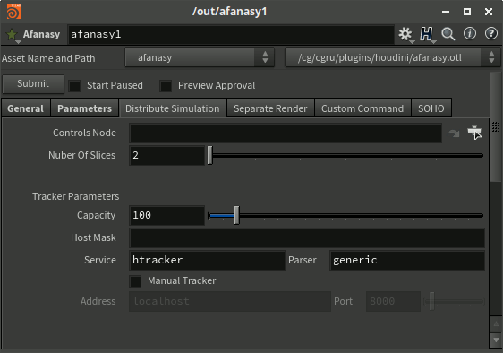

	Afanasy ROP Separate Render tab

- Controls Node
	Distributed simulation control node.

- Number Of Slices
	Distributed simulation slices number.

- Tracker Parameters

	Distributed simulation slices tasks should communicate via tracker service.

	- Capacity
		Tracker task capacity.

	- Host Mask
		Tracker will run only hosts that names match this regular expression.

	- Service
		Tracker task service.

	- Parser
		Tracker task parser.

	- Manual Tracker
		Use manual launched tracker service at specified **Address** and **Port**

Separate Render
---------------

Separate Render allows to separate render process on IFD files generation and render it by ``mantra``.
It can give several advantages on some *heavy* scenes.

Separate render generates a job that can:

- Render images locally in temporary folder and copy whole image after successful render.
  It can save your network traffic as render do not send small portions of an image during render process.
- Generate IFD file locally and then render it in separate process but in the same task.
  It can save render memory.
- Split one frame on tiles to render them simultaneously.
  So you can increase speed of one frame render.
  And also it can reduce memory needed to render a frame.
- Cleanup rendered IFD files and joined tiles images.

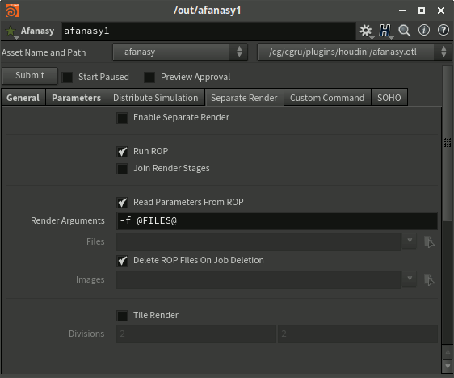

	Afanasy ROP Separate Render tab

- Enable Separate Render
	Turn this feature on.
- Run ROP
	Run ROP to generate files to render.
	Houdini will generate IFD files for mantra.
- Join Render Stages
	Generate IFD files and render in the same task.
	In this case IFD files will be generated to local temporary folder.
	It can save and memory usage and network traffic.
- Read Parameters from ROP
	Read files to generate and images to render parameters from specified ROP.
- Render Arguments
	Arguments for render command.
	Usually files and may be some other options.
- Files
	Files to generate.
- Delete ROP Files On Job Deletion
	ROP files (IFD-s) can be deleted when user will delete the job.
- Images
	Images which render will produce. Needed for tile render, AfWatch preview/thumbnails.
- Tile Render
	Enable rendering tiles and then combine them.
- Divisions
	Tiles divisions.

Custom Command
--------------

Run any custom command.
For example you can render IFD files using ``mantra`` command,
generate a preview movie with ``ffmpeg``. 

.. figure:: images/houdini_afrop_command.png

	Afanasy ROP Custom Command tab

- Custom Command Mode
	Add custom command tasks block to a job.
- Name
	Tasks block name.
	If empty the first word of the command will be used.
- Command
	The command.
- Prefix with $AF_CMD_PREFIX
	Add ``$AF_CMD_PREFIX`` environment variable value to the beginning of the command.
	This may be needed for some software (environment) setup.
- Files
	Some files you can point to use in command.
- Delete Files On Job Deletion
	Delete this files when user will delete job.
- Preview
	Specify result picture here to enable tasks preview.
- Service
	Tasks block service.
	If empty the first word of the command will be used.
- Parser
	Tasks block parser.

SOHO
----

This can be used to explain other ROP network what to do with Afanasy node.

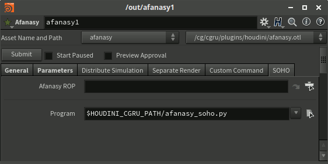

	Afanasy ROP SOHO tab

- Afanasy ROP
	Specify Afanasy ROP to execute by SOHO.
- Program
	Script that will be executed on SOHO demand.
	That default script will execute *Submit* button on a specified Afanasy ROP.

Examples
========

Simple
------

Just connect ``afanasy`` ROP to your render ROP. 

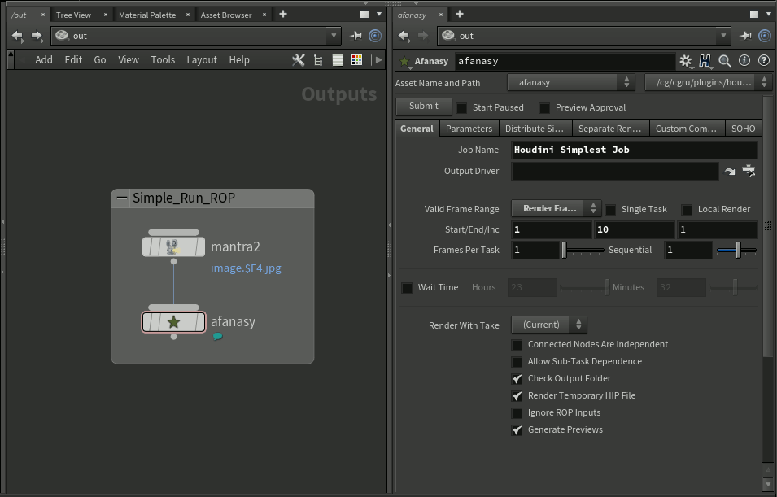

	Simple Network

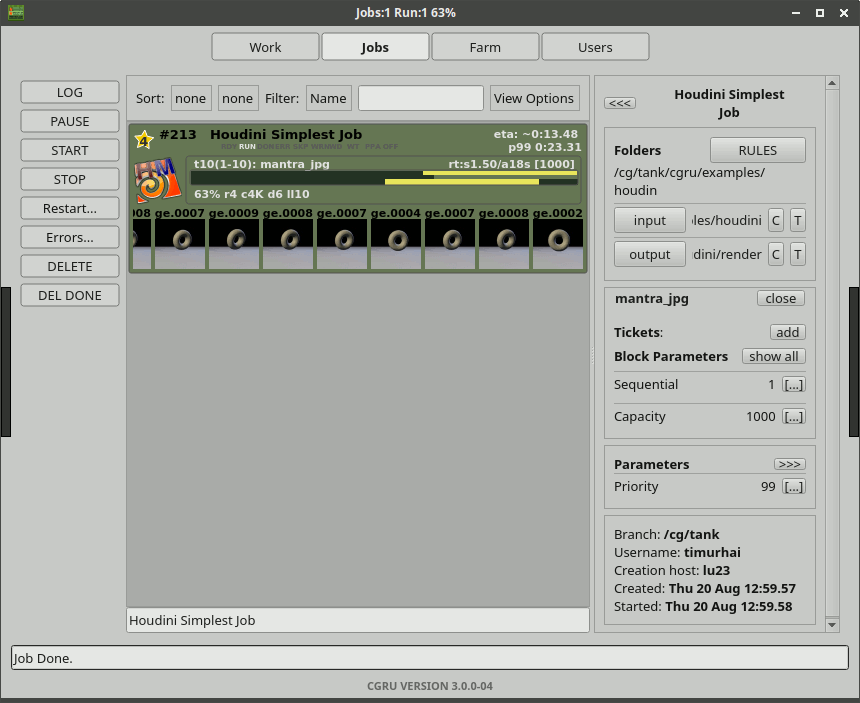

	Simple Job

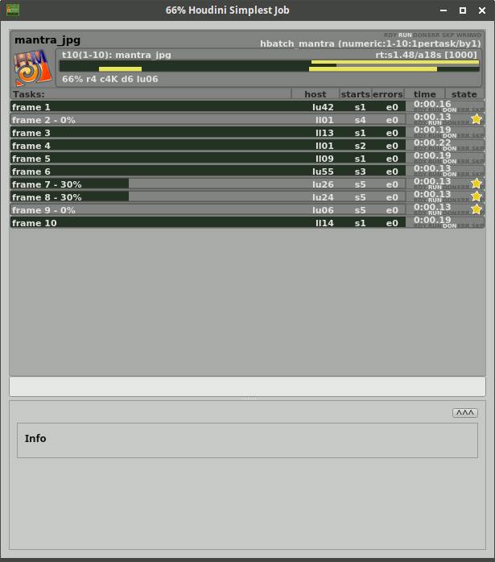

	Simple Job Tasks

The job consists of single tasks block.
Each task represents a frame or several number of frames, specified in *Frames Per Task* parameter.

Command Render
--------------

You can send any custom command to your farm.
Usually you need separate IFD files generation and run ``mantra`` as a standalone process to render.

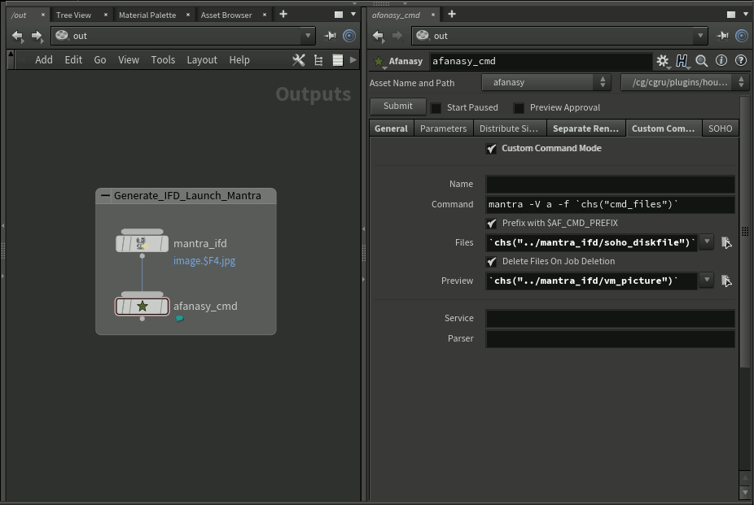

	Command Network

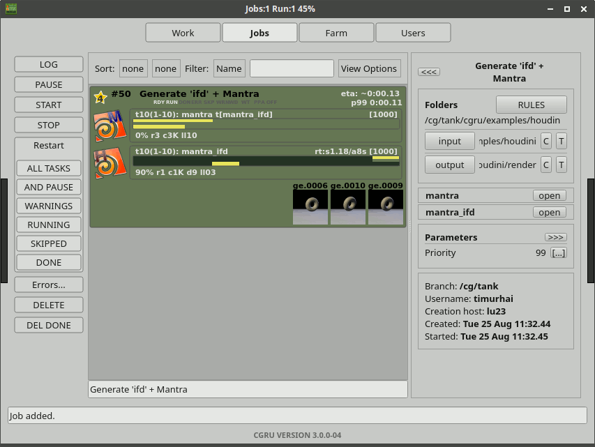

	Command Job

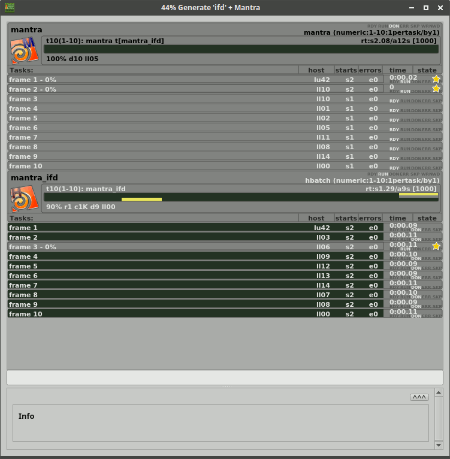

	Command Job Tasks

This job consists of two blocks of tasks.
The first block produced by ``mantra_ifd`` node, with ``Disk File`` parameter turned on.
Next block runs ``mantra`` with ``files`` parameter pointing to the generated files.

Tile Render
-----------

You can split single image to render on several hosts.
Each host (task) will produce a *tile* - some part of an image.
Tiles will be combined in a single image.

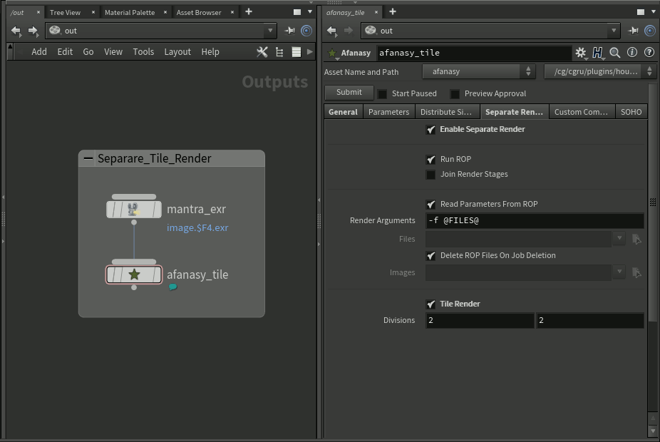

	Tile Render Network

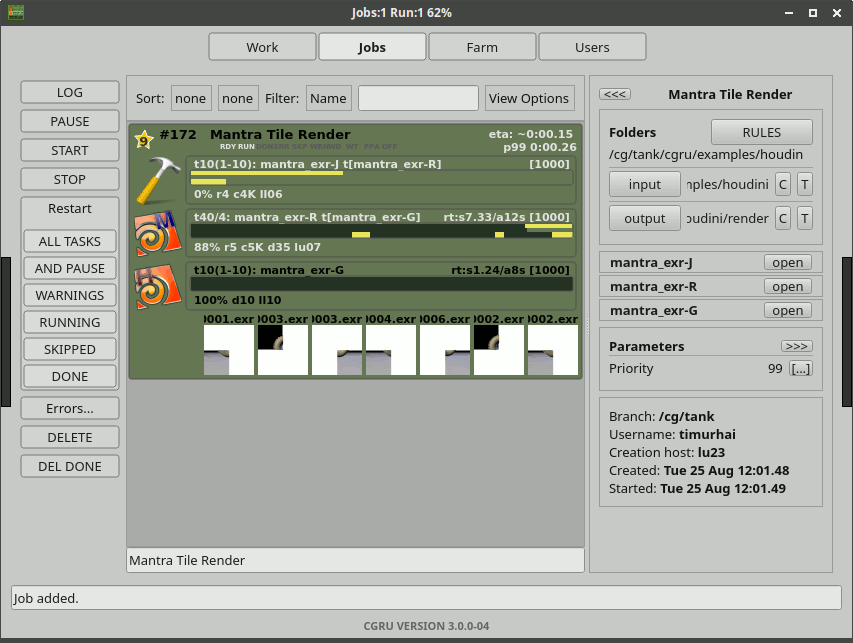

	Tile Render Job

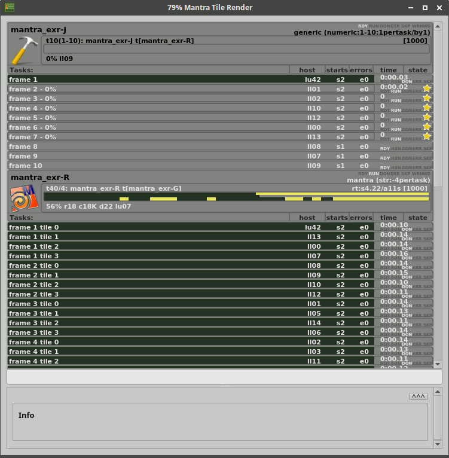

	Tile Render Job Tasks

Tile job consists of three blocks:

- Generate
	Generate IFD files.
- Render
	Render tiles with ``mantra`` standalone process.
- Join
	Join tiles to assemble an image.
	If tiles were successfully joined they will be removed.
	At the end of this stage, IFD will be removed, if it was asked.

Houdini native ``itilestitch`` tool is used to join tiles. 

Sub Task Dependence
-------------------

This option is designed to start to render simulation without waiting the whole simulation is finished.

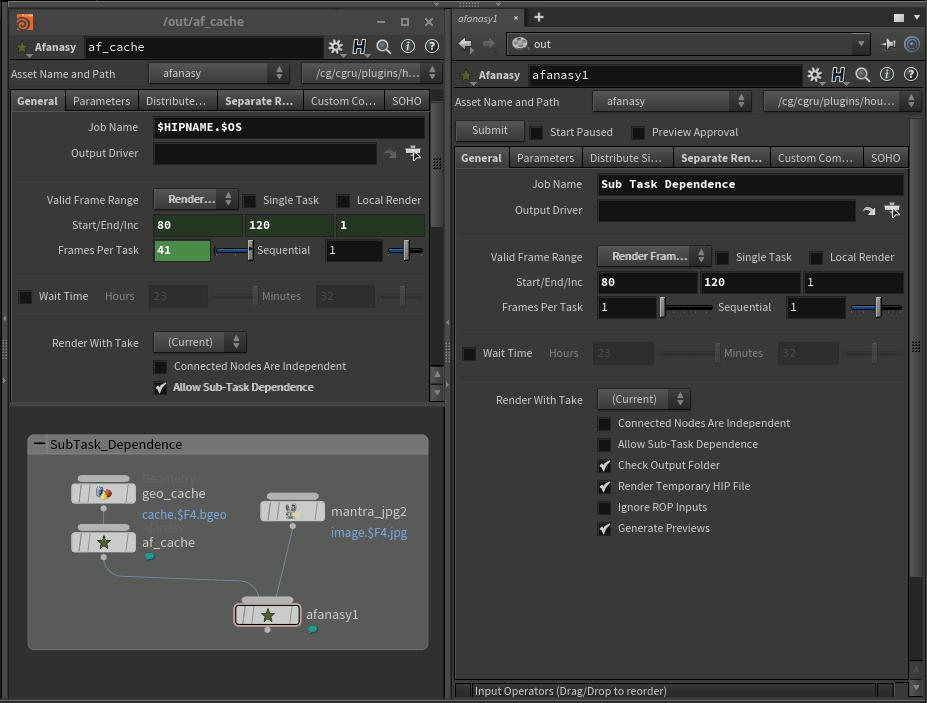

	Sub-Task Dependence Network

The first block of a job is a simulation.
It consists of a single task (*Frames Per Task* parameter is set to the whole frame range).
The second block set to wait the first one with sub-task dependence.
So it begins to render as first frames of a simulation completed, while the simulation task is still running. 

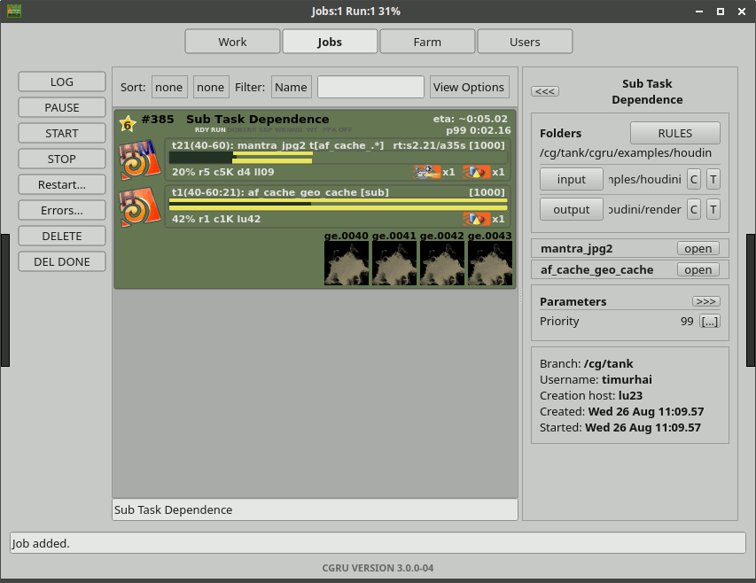

	Sub-Task Dependence Job

We also can notice here, that the render block got *HYTHON* and *MANTRA* tickets,
while the simulation block got only *HYTHON* ticket

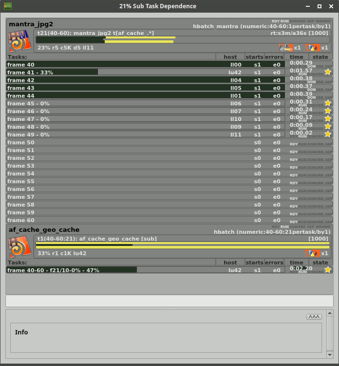

	Sub-Task Dependence Job Tasks

Complex
-------

You can construct a complex Afanasy ROP network to construct a complex job.

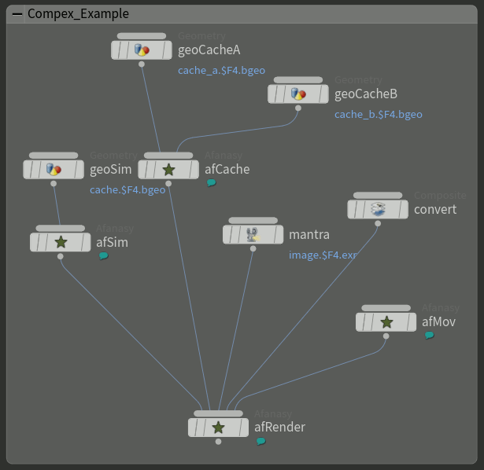

	Complex Network

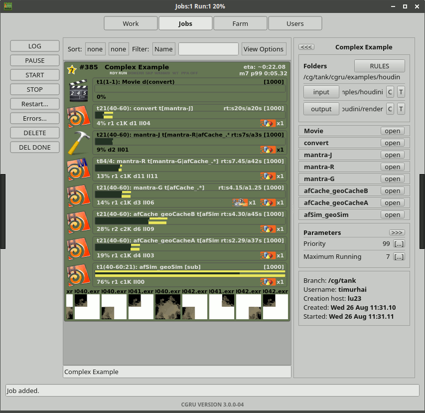

	Complex Job

This job consists of a simulation with sub-task dependence.
Two caches waiting the simulation, but can run independently from each other.
Mantra tile render which produces three blocks which wait all the cache.
Two blocks for preview which can run independently but wait tile render tasks.
One to convert EXR files to JPEG-s and one to generate a preview movie form EXR-s.

Distributed Simulations
=======================

Houdini can calculate the same simulation on several machines.

How It Works
------------

Simulation can be split on slices, so each machine calculates own slice.
But different slices simulations should exchange information to pass data from slice to slice.
Houdini has a special Python script *simtracker.py* for it.
It needs to launch a server that simulations will connect to.
So each slice simulation should know tracker address and port.
Also tracker has a simple web interface to see logs.

What We Should Do
-----------------

- Prepare distributed simulation, setup slices.
- Launch tracker server and get its address and port.
- Open several Houdini applications with simulation scene (on different machines or not).
- Specify tracker and port.
- Start each Houdini instance to simulate own slice.
- Stop tracker.

So, you can distribute Houdini simulation without any render farm manager.

Step-By-Step
------------

#. Create a sphere.
#. Create simulation via Wispy Smoke shelf tool.
#. Apply Distribute Container shelf tool.
#. You will be moved to */out/* network.
#. Create Afanasy ROP node.
#. Set *Output Driver* to */obj/distribute_pyro/save_slices*
   and in the *Distributed Simulation* tab set *Controls Node* to */obj/AutoDopNetwork/DISRIBUTE_pyro_CONTROLS*.
   You can copy this values from *HQueue Simulation* ROP that was automatically created.
	.. figure:: images/houdini_distribpyro_afgeneral.png
         :scale: 22%
         :align: left
	
         Genetal Tab

	.. figure:: images/houdini_distribpyro_afdistrib.png
         :scale: 30%

         Distributed Simulation Tab

#. Uncheck *Render Temporary HIP File* option on Afanasy ROP.
   By default, Afanasy renders a temporary scene to allow user to continue working with original file.
   But in this case *$HIPNAME* variable will change, and it widely used in shelf tools and examples.
#. Go to */obj/AutoDopNetwork/*.
#. Remove resize_container node.
#. Disconnect *distribute_pyro* node from *merge* node (do not merge it with source). And connect it to the solver *Velocity Update* input.
	.. figure:: images/houdini_distribpyro_dop_orig.png
		:scale: 20%
		:align: left

		Original network

	.. figure:: images/houdini_distribpyro_dop_adjust.png
		:scale: 20%

		Adjusted network

#. Set slices divisions 1 x 2 x 1.
#. Now you can submit simulation by Afanasy ROP in */out/* network.

Afanasy Job
-----------

Afanasy will create a job that consists of four blocks each contains just one task.
First block task to start tracker.
A block (task) for each slice that waits tracker start.
And the last block task to stop the tracker.

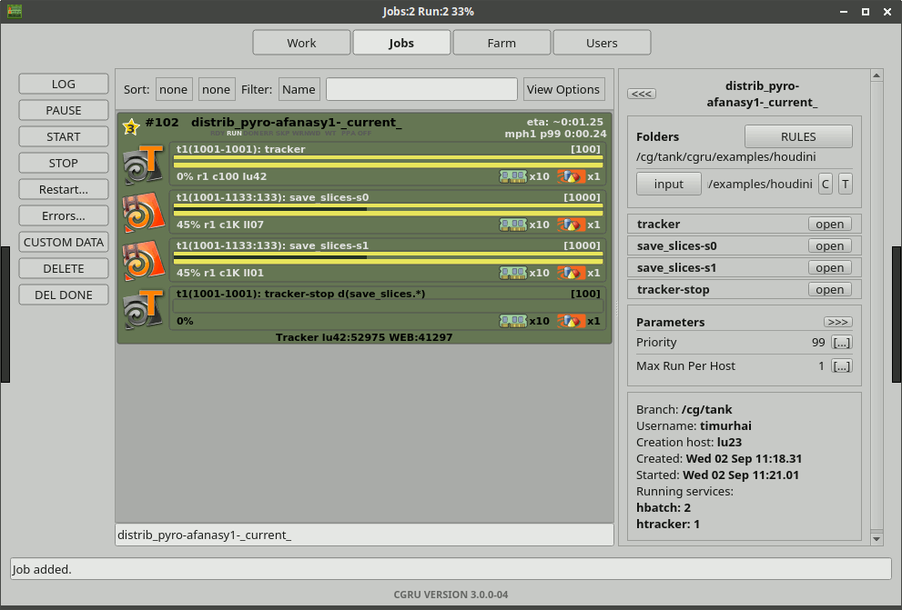

	Distributed Simulation Job Running

#. **tracker**

   The first task block has a special service *htracker*.
   This service just adds job ID to the task command.
   Job ID is needed to manipulate job using JSON protocol.
   The command calls a special CGRU Python script ``plugins/houdini/htracker.py``.

   .. code-block:: bash

	htracker --start --envblocks "save_slices.*|tracker-stop" --depblocks "save_slices.*"
	
   - It starts Houdini *simtracker* in a separate thread and gets its address and port.
   - Set other job blocks environment variables ``TRACKER_ADDRESS`` and ``TRACKER_PORT``
     to blocks specified by *--envblocks* argument.
   - Set slices job blocks depend masks to an empty string
     to blocks specified by *--depblocks* argument,
     So that blocks will wait nothing and can to start.
   - Waits *simtracker* for completion.

#. **save_slices-s0**

   The first slice simulation.
   Slices are simulated by CGRU multi-functional Hython script
   ``cgru/plugins/houdini/hrendef_af.py`` that Afanasy uses for almost everything.

   .. code-block:: bash

	hrender_af -s 1001 -e 1133 --by 1 -t "_current_" --ds_node "/obj/AutoDopNetwork/DISTRIBUTE_pyro_CONTROLS" --ds_address "localhost" --ds_port 8000 --ds_slice 0 "/opt/cgru/examples/houdini/distrib_pyro.hip" "/obj/distribute_pyro/save_slices"

   Control node, tracker address and tracker port,
   that was specified in Afanasy ROP and passed by command line argument,
   will be overridden by environment variables.

   Script will open HIP file, set control node tracker address and port parameters.
   Set *SLICE* variable to the specified slice number.

   Run simulation ROP.

#. **save_slices-s1**

   The second slice simulation. It is the same as the first, but with one key difference.
   Slice will be equal to 1.

   .. code-block:: bash

	hrender_af -s 1001 -e 1133 --by 1 -t "_current_" --ds_node "/obj/AutoDopNetwork/DISTRIBUTE_pyro_CONTROLS" --ds_address "localhost" --ds_port 8000 --ds_slice 1 "/opt/cgru/examples/houdini/distrib_pyro.hip" "/obj/distribute_pyro/save_slices"

#. **tracker-stop**

   Stop tracker. It will be performed by the same script that starts tracker.

   .. code-block:: bash
	
	htracker --stop

   It just sends ``quit`` string to tracker_address:tracker_port socket.

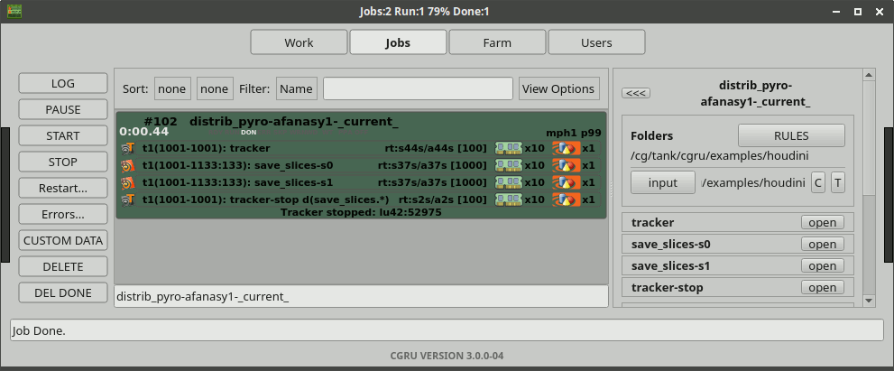

	Distributed Job Done

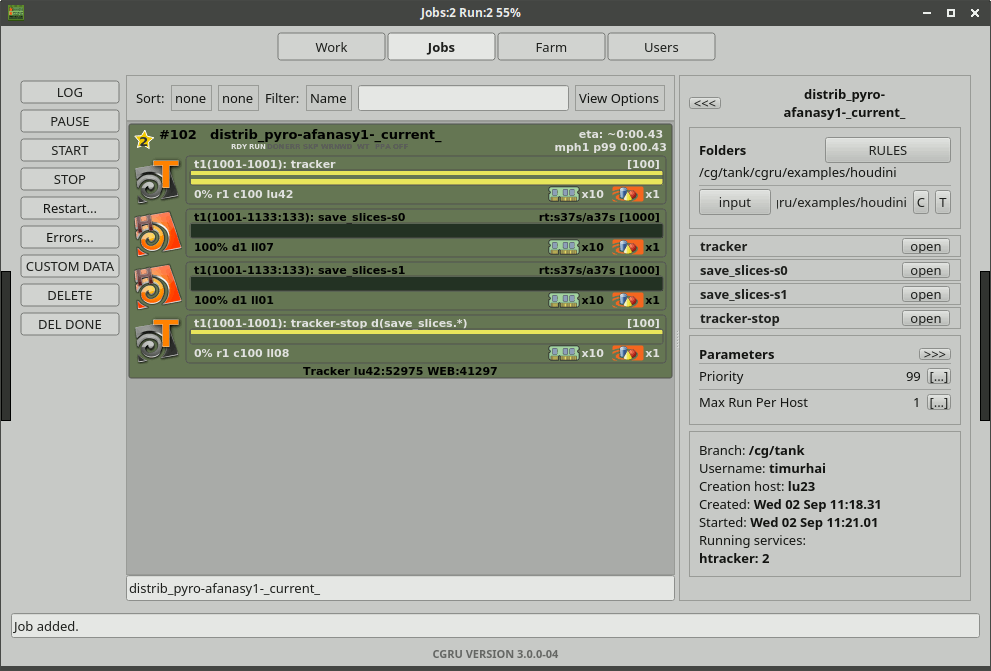

	Distributed Job Stopping

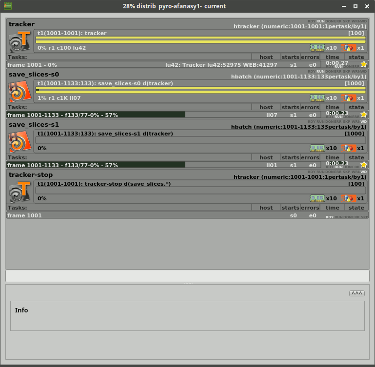

	Distributed Job Tasks

Setup
=====

CGRU setup should be sourced before.
To do this you can source *setup.sh* script in CGRU root folder.
Afanasy Houdini operator library and Python module are located in:

``cgru/plugins/houdini``

You should add this folder ``HOUDINI_OTLSCAN_PATH`` and ``PYTHONPATH`` environment variables.

Houdini setup example (*bash*):

.. code-block:: bash

	# Setup CGRU
	cd /opt/cgru
	source ./setup.sh

	# Setup CGRU houdini scripts location:
	export HOUDINI_CGRU_PATH="${CGRU_LOCATION}/plugins/houdini"

	# Append OTL scan path with afanasy.otl location:
	export HOUDINI_OTLSCAN_PATH="${HOUDINI_CGRU_PATH}:&"

	# Append Python path with afanasy submission script:
	export PYTHONPATH="${HOUDINI_CGRU_PATH}:${PYTHONPATH}"

If you avoid sourcing ``cgru/setup.sh`` see :ref:`manual-environment-setup`.

