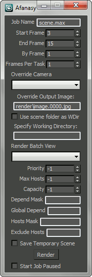

=============
3D Studio Max
=============

CGRU creates a menu in main window menus panel.
Menu creation script file is ``cgru\plugins\max\startup.ms``.
To setup MAX to launch this script automatically you can add this folder in PATH.
On every start MAX searches PATH for ``startup.ms`` scripts and launches them.

Submission Dialog
=================

CGRU -> Afanasy...

	
.. image:: images/max_afwatch_job.png

- Job Name
    Job name.
    Scene name by default.
- Start Frame
    First frame to render.
- End Frame
    Last frame to render.
- By Frame
    Render every Nth frame.
- Frames Per Task
    Number of frames in one task.
- Override Camera
    Select camera to render.
- Override Output Image
    Specify output image.
- Use Scene Folder As WDir
    Use scene file folder as render process working directory.
    3D Studio Max, its plugins sometimes change working directory.
    With this option it will be always the scene folder.
- Specify Working Directory
    Set custom working directory.
- Render Batch View
    Select batch view to render.
- Priority
    Job order in user job list, '-1' - use default priority.
- Max Hosts
    Maximum number of hosts job can capture (running tasks limit), '-1'
    no limit.
- Capacity
    Job tasks capacity, '-1' - use default value.
- Depend Mask
    Wait same user jobs names pattern.
- Global Depend
    Wait any user jobs names pattern.
- Hosts Mask
    Job can run only on hosts which names match this pattern.
- Exclude Hosts
    Job can not run on hosts which names match this pattern.
- Save Temporary Scene
    Copy scene to temporary file to render.
    It allows user to continue working with original file.
- Start Job Paused
    Send job in offline state.

