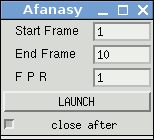

====
Maya
====

.. warning:: Documentation is outdated.

meTools for Afanasy
===================

http://meshstudio.blogspot.ru/2013/01/metools-for-afanasy.html

Maya VRay, Arnold and MentalRay standalone rendering.

Stand-Alone Dialog
==================
Use AfStarter_

.. _AfStarter: ../afstarter/afstarter.html

The Simplest MEL Dialog
=======================

Afanasy menuitem in CGRU raises a window.
Dialog is minimalistic but enough to do anything that needed in most cases.
It can render any engine type: Software, VRay, Arnold, MentalRay or whatever.
It simple runs Maya Render command and ask it to open scene and render special frame(s).
All render settings Maya takes from render globals in this case.

CGRU Maya
=========

A set of MEL scripts and a plug-in.

Documentation:

https://cgru.info/maya

