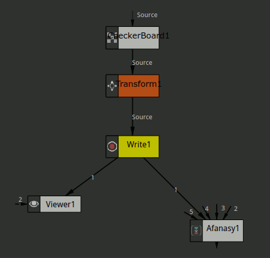
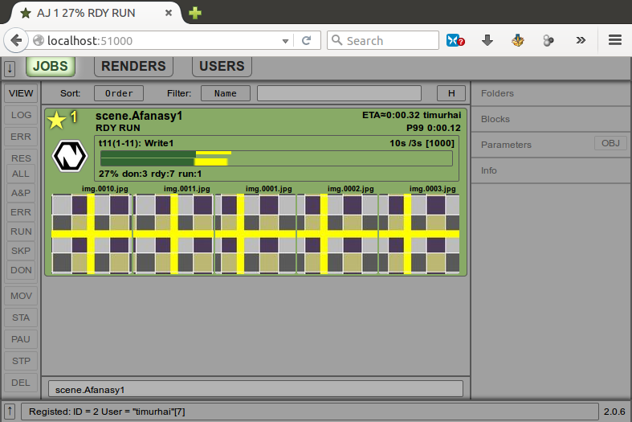
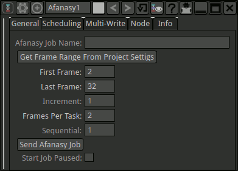
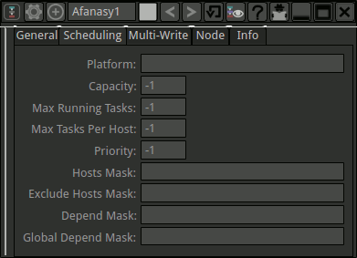
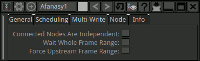
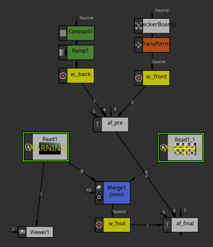
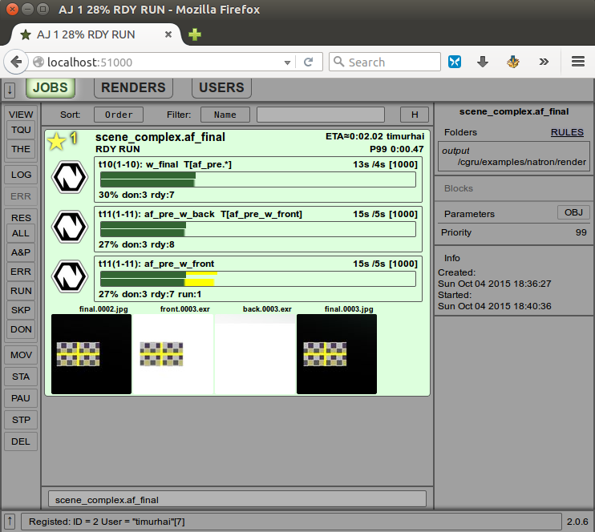
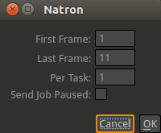

.. _software-natron:

======
Natron
======

CGRU in Natron consists of Afanasy node (group) and menu items in main CGRU menu.

Afanasy nodes need to render connected Write nodes and to store render settings.
You can connect one Afanasy node to other Afanasy node to render other Write node with different settings at the same time.
Each connected node will produce a block - an array of tasks (frames) to render.
You can specify dependence between connected nodes.

    Node Graph

	Job (Web GUI)

Afanasy Node
============

General
-------

- Job Name
    Name to add to job or blocks names.
    If empty, Afanasy node label will be used.
- Get Frame Range From Project Settings
    Set first and last frames to project settings.
- First Frame
    First frame to render.
- Last Frame
    Last frame to render.
- Increment
    Frames increment step.
- Frames Per Task
    Number of frames in task.
- Sequential
    Frames solving method.
- Send Afanasy Job
    Construct and send job to Afanasy server.
- Start Job Paused
    Job will be send paused.

Scheduling
----------

- Platform
    OS type the job can launch tasks on: 'Any' - any OS, 'Native' - the same as the script was launched on.
- Capacity
    Tasks capacity. '-1' - use default value.
- Max Running Tasks
    Maximum number of running at the same time tasks. '-1' means no limit.
- Max Tasks Per Host
    Maximum number of running at the same time at the same host tasks. '-1' means no limit.
- Priority
    Job priority. '-1' - set default priority value.
- Hosts Mask
    Job will only on hosts which name matches this pattern.
- Exclude Hosts Mask
    Job will not run on hosts which name matches pattern.
- Depend mask
    Job will wait job(s) to be done, which name(s) matches pattern.
- Global Depend mask
    The same, but will wait for jobs from any user.

MultiWrite
----------

- Connected Nodes Are Independent
    Nodes can run at the same time, they will not wait each other.
- Wait Whole Frame Range
    Down stream connected node(s) will wait until whole specified frame range will be rendered.
    If not checked, each frame will be wait only corresponding frame(s) from this node.
- Force upstream frame settings
    All upstream connected Afanasy nodes will use this node frame range.

Complex Situation
=================

In this example Final Write waits Back and Front precomps to be rendered.

	Complex Network

First job block from **w_final** Write node has ``af_pre.*`` tasks depend mask.
This means that it will wait all Write nodes that connected to **af_pre** Afanasy group.

	Complex Job (Web GUI)

Examples are located in ``cgru/examples/natron``.

Render Selected
===============

- First Frame
    First frame to render.
- Last Frame
    Last frame to render.
- Per Task
    Number of frames in task.
- Send Job Paused
    Job will be paused.

Setup
=====

If you start Natron from CGRU Keeper all should work automatically.

Manual Setup
------------

CGRU Natron plugins are located in

``cgru/plugins/natron``

Add this path to ``NATRON_PLUGIN_PATH`` environment variable.

