====
Nuke
====

CGRU Menu
=========

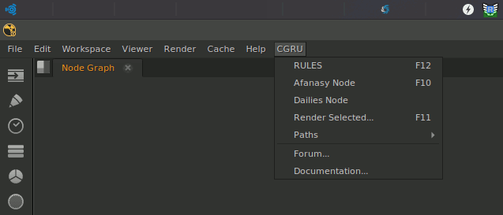

	Nuke CGRU Menu

Nuke Afanasy interface consists of **afanasy** nodes (gizmos) and menu items in main CGRU menu.

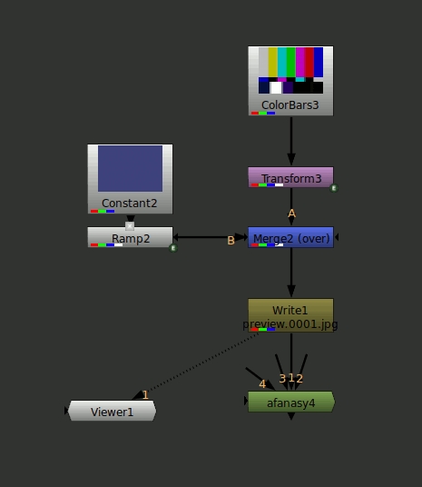

	Complex Node Network

Just create **afanasy** gizmo *(F10)* and connect it to **Write** node to render.

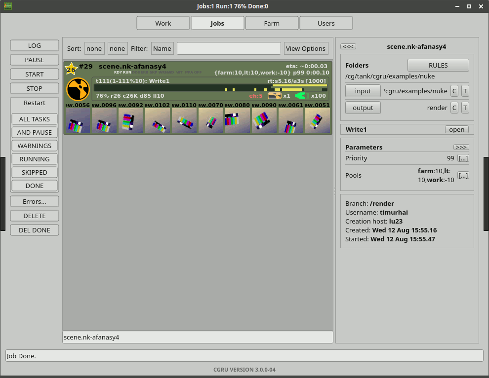

	Complex Job (AfWatch)

Afanasy Gizmo
=============

General
-------

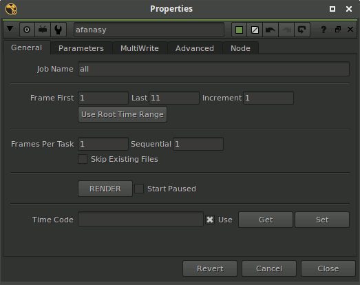

	Afanasy Gizmo General Tab

- Job Name
    Name to add to job or blocks names.
    If empty, 'afanasy' node name will be used.
- Use Root Time Range
    Set 'First Frame' and 'Last Frame' fields to project settings.
- First Frame
    First frame to render.
- Last
    Last frame to render.
- Increment
    Frame increment.
- Frames Per Task
    Number of frames in task.
- Sequential
	===== =====
	   1   Render frames one by one from the first to the last
	  10   Render every 10 frame at first, than render last other frames
	  -1   Render frames backwards from the last to the first
	 -10   Render every 10 frame at first backwards, than render last other frames backwards
	   0   Render the first, the last, the middle, the middle of the middle and so on
	===== =====
- Skip Existing Files
	Skip existing files works fine, when *Frames Per Task* is 1
- Render
    Send job to Afanasy server.
- Start Paused
    Job will be sent in offline state.
- Time Code
	Two Time Codes from - to.

	- Use
		Use Time Code instead of frame range.
		If Time Code is empty, frame range will be used.
	- Get
		Get Time Code from frame range.
	- Set
		Set frame range from Time Code.

Parameters
----------

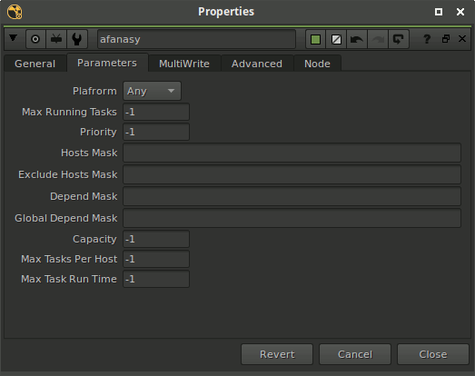

	Afanasy Gizmo Parameters Tab

- Platform
    OS type the job can launch tasks on: *Any* - any OS,
    *Native* - the same as the script was launched on.
- Max Running Tasks
    Maximum number of running tasks at the same time.
    *-1* means no limit.
- Priority
    Job priority.
    *-1* - use default priority value.
- Hosts Mask
    If not empty, job can run only on hosts which name matches this pattern.
- Exclude Hosts Mask
    If not empty, job can not run on hosts which name matches pattern.
- Depend mask
    If not empty, job will wait job(s) to be done, which name(s) matches pattern.
- Global Depend mask
    The same, but will wait for jobs from any user.
- Capacity
    Tasks capacity.
    *-1* - use default value.
- Max Tasks Pet Host
	Maximum running tasks on the same host at the same time.
- Max Task Run Time
	Maximum task running time in seconds.
	After this time, running task will be restarted.
	Useful if script can hang.

MultiWrite
----------

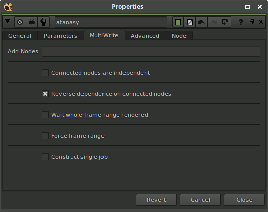

	Afanasy Gizmo MuitiWrite Tab

- Connected nodes are independent
    nodes can run at the same time, they will not wait each other.
- Reverse dependences on connected nodes
    First block will wait second block.
    Most depended "Write" node usually produces more final result,
    and it will be executed as soon as possible.
- Down stream will wait for whole frame range rendered
    Down stream connected node(s) will wait until whole specified frame range will be rendered.
    If not checked, each frame will be wait only corresponding frame(s) from this node.
- Force upstream frame settings
    All upstream connected nodes will use this node frame range.
    Connected upstream node can re-force it, if this parameter is checked too.
- Construct single job from all connected write nodes
    Construct a block from each connected 'Write' node and put them into one job.
    If not checked, each connected 'Write' node will produce a job.

Advanced
--------

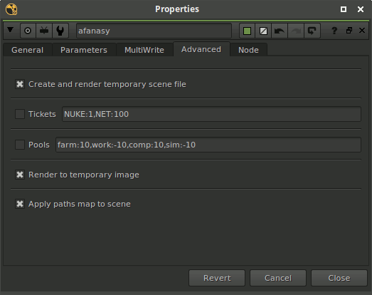

	Afanasy Gizmo Advanced Tab

- Create and render temporary scene
	On job creation, nuke submission script saves scene to temporary name.
	That temporary scene will be rendered and deleted on a job deletion.
	This way artist can continue to modify and save working scene.
	And all frame will be rendered from the same modified scene.
- Tickets
	Job Block tickets counts.
	Syntax like: ``NAME1:count1,NAME2:count2``.
	Tasks will run only on pools that has enough free tickets.
	See :ref:`afanasy-tickets` documentation for details.
- Pools
	Pools that job will run on with priorities.
	Syntax like: ``name1:priority,name2:priority2``.
	Tasks will prefer pools with a greater priority.
	See :ref:`afanasy-pools` documentation for details.
- Render to temporary image
	This can save network traffic, as the entire image will be saved at once.
	By default Nuke writes a portions of rendered frame.
- Apply paths map to scene
	Transfer all scene files paths from client to server.
	Using CGRU Path Map you can work and render on different platforms.

Complex Job (Precomps)
======================

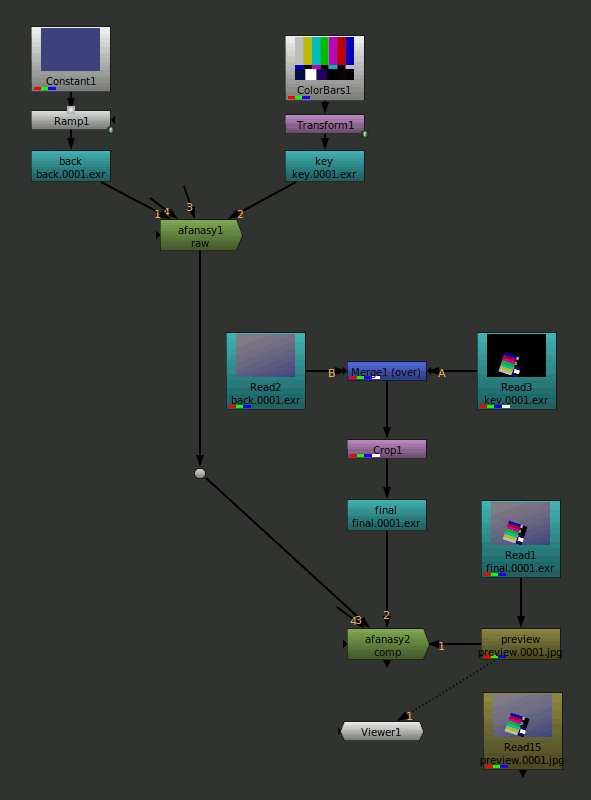

	Complex Node Network

You can connect one **afanasy** node to several **Write** and **afanasy** nodes.
Each connected node will produce a block - an array of tasks (frames) to render.
You can specify dependence between connected nodes.
This is useful to re-render precomps and the final result in a single job.

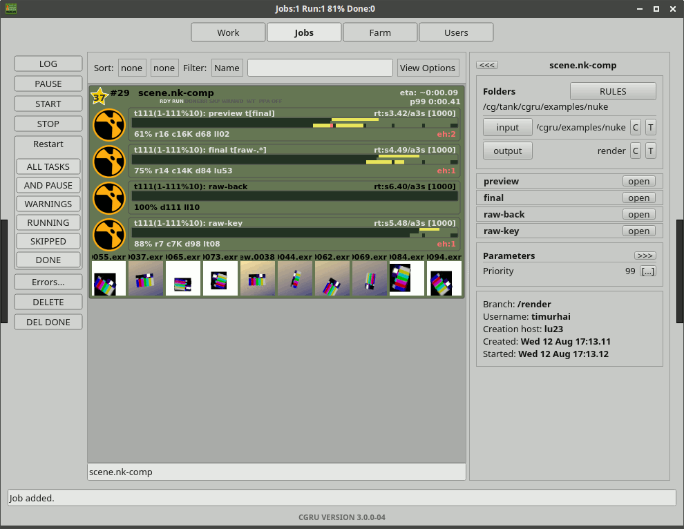

	Complex Job (AfWatch)

Render Selected
===============

You can send to farm selected node(s) using a simple dialog *(F11)*. 

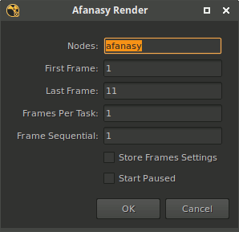

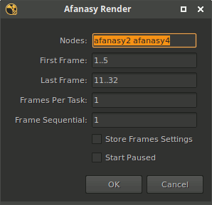

``1..5`` - two numbers, separated with two points means the lowest and highest value from all selected nodes.
Type one number in input field to override frame settings on selected nodes.

- Nodes
    Selected nodes names. You can check and edit selection.
- First Frame
    First frame to render.
- Last Frame
    Last frame to render.
- Frames Per Task
    Number of frames in task.
- Store Frames Settings
    Store frame settings on selected nodes.
- Start Paused
    Job will be created in offline state.

Setup
=====

You can launch nuke from CGRU Keeper and it set all needed environment.

Or you can setup CGRU manually.
Setup CGRU and append its ``cgru/nuke/plugnis`` to ``NUKE_PATH``:

.. code-block:: bash

	cd /opt/cgru

	source ./setup.sh

	export NUKE_PATH="${NUKE_PATH}:${CGRU_LOCATION}/plugins/nuke"

