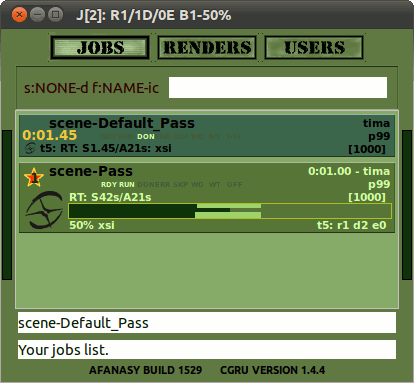

=============
Softimage XSI
=============

Afanasy Window
==============

Submission
----------

.. figure:: images/xsi_afwindow_submission.png

	Submission Tab

- Job Name
    Job name. Scene name by default. And pass name if render several passes at once.
- Pass
    Pass(es) to render. You can choose to render current, all or selected pass(es).
- Take Frame Range From Pass
    Render pass with its own frame range, if it is set.
- Force Pass Frame Range
    Render specified below frame range in any case.
- Start Frame
    First frame to render.
- End Frame
    Last frame to render.
- By Frame
    Frames increment.
- Frames Per Task
    Number of frames to render by one task.
- Simulate
    Force not to simulate by setting Play Control to Frame Range.
- Start Job Paused
    Send job in Off-line state.

	Job (AfWatch)

Scheduling
----------

.. figure:: images/xsi_afwindow_scheduling.png

	Scheduling Tab

- Priority
    Job Priority parameter, ``-1`` use default priority.
- Capacity
    Job tasks Capacity, ``-1`` use default capacity.
- Max Hosts
    Maximum Hosts the job can run on, ``-1`` means no limit.
- Task Max Run Time
    Maximum Time, ``0`` means no limit.
- Hosts Mask
    Hostname Mask pattern, job can run on.
- Exclude Hosts Mask
    Hostname Mask Exclude pattern, job can not run on.
- Depend Mask
    Job names Depend Mask pattern, to wait other jobs to finish.
- Global Depend Mask
    Job names Depend Mask Global pattern, to wait other jobs from any user to finish.

VariRender
----------

VariRender can help you to automatically increment some value and to render scene with different parameters at once.
For example particles with different seed, to increase their quantity by compositing.

.. figure:: images/xsi_afwindow_varirender.png

	VariRender Tab

- Enable VariRender
    Turn it on or off.
- Attribute
    Attribute name to variate.
    Change some object parameter and look script editor, or command line for name.
- Start Value
    First value to start from.
- Step
    Value increment.
- Count
    Quantity of value increments.

This is a job from CGRU examples.
Rendering two passes with VariRender.

.. figure:: images/xsi_afwatch_varirender.png

	VariRender Job

For each pass it generates a job.
For each parameter value it generates a block of tasks.

